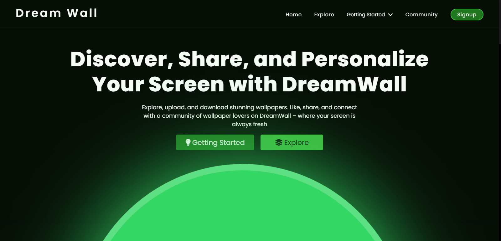
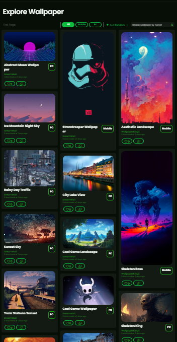
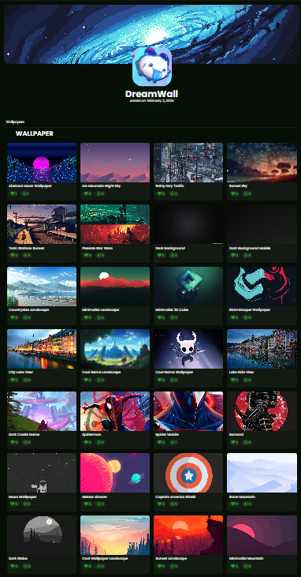
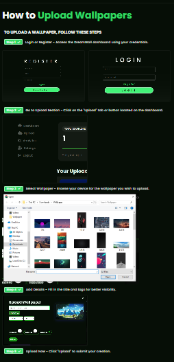

# DreamWallV2

DreamWallV2 is a next-generation wallpaper sharing platform that allows users to explore, upload, and share high-quality wallpapers. Built with modern web technologies, it provides a seamless and engaging experience for wallpaper enthusiasts.

## Features

- **User Authentication**: Sign up, log in, and manage accounts.
- **Wallpaper Upload & Management**: Users can upload, organize, and manage their wallpapers.
- **Categories & Tags**: Browse wallpapers by categories and tags for easy discovery.
- **Search & Filters**: Advanced search options with filtering capabilities.
- **User Profiles**: View and follow other users' uploads.
- **Favorites & Downloads**: Save favorite wallpapers and download them in high resolution.
- **Responsive Design**: Optimized for both desktop and mobile users.

## Tech Stack

- **Frontend**: React
- **Backend**: Node.js, Express.js, MongoDB
- **Authentication**: JWT (JSON Web Tokens)
- **Storage**: Cloudinary / Local file storage (configurable)
- **Deployment**: Vercel (Frontend), Render (Backend)

